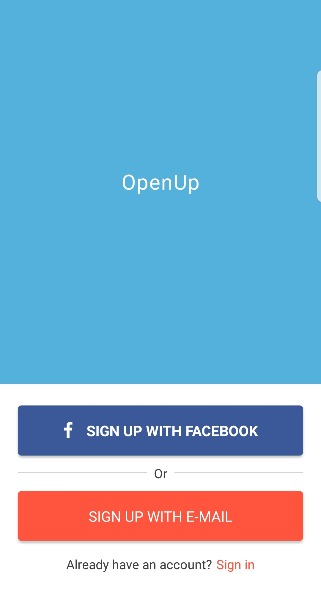
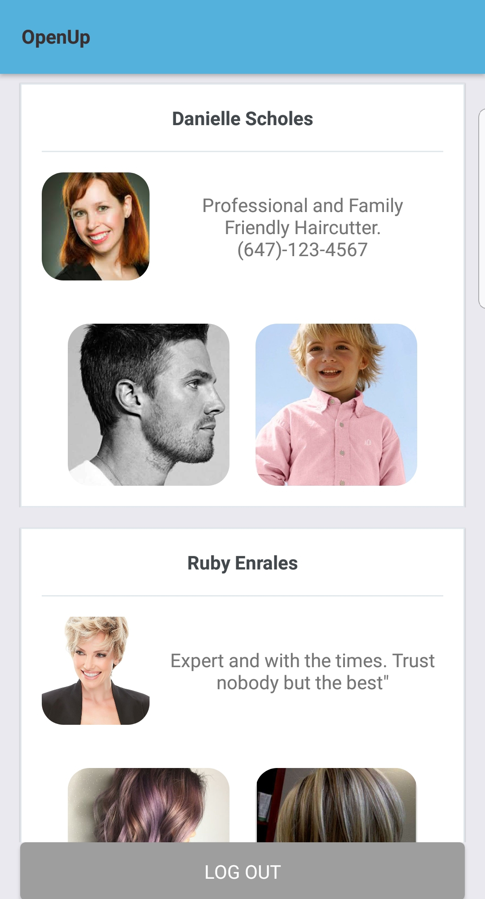

# OpenUp - Hack the North 2018
A platform for small businesses to flourish.

## Showcase

  

## Dev Installation
1) Create a Firebase database and account
2) In ./app/config/constants.js, insert your Firebase Authentication information
3) "npm install"
4) "npm run android" if you have an android virtual machine or your device is hooked up
5) "npm run ios" if on High Sierra or your iPhone is hooked up

